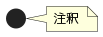
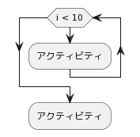
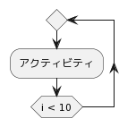
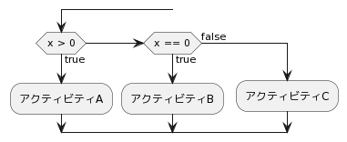
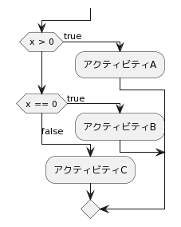
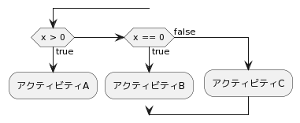
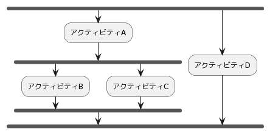
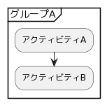

# アクティビティ図(新記法)

## 目次
# 基本
|Syntax|Output|
|:------|:-----:|
|start||
|:アクティビティA;||
|:アクティビティB -br- (改行);|;.png)|
|stop||
|note right -br-  注釈 -br- end note||

# ループ処理
|Syntax|Output|
|:------|:-----:|
|while (i < 10) -br- :アクティビティ; -br- endwhile| |
|repeat -br- :アクティビティ; -br- repeat while (i < 10)||

# 分岐処理
|Syntax|Output|
|:------|:-----:|
|if (x > 0) then (true) -br- :アクティビティA; -br- else if (x == 0) then (true) -br- :アクティビティB; -br- else (false) -br- :アクティビティC; -br- endif||
|!pragma useVerticalIf on -br- if (x > 0) then (true) -br- :アクティビティA; -br- else if (x == 0) then (true) -br- :アクティビティB; -br- else (false) -br- :アクティビティC; -br- endif||
|if (x > 0) then (true) -br- :アクティビティA; -br- kill -br- else if (x == 0) then (true) -br- :アクティビティB; -br- kill -br- else (false) -br- :アクティビティC; -br- endif||

# 並列処理
|Syntax|Output|
|:------|:-----:|
|fork -br- :アクティビティA; -br- fork -br- :アクティビティB; -br- fork again -br- :アクティビティC; -br- end fork -br- fork again -br- :アクティビティD; -br- end fork||

# グループ化
|Syntax|Output|
|:------|:-----:|
|group グループA -br- :アクティビティA; -br- :アクティビティB; -br- end group||
