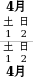
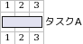
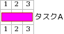
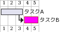
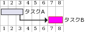
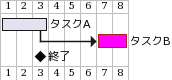
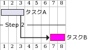

# ガントチャート

## 目次
# 言語
|Syntax|Output|
|:------|:-----:|
|language ja|日本語|

# 日付
## 開始日
|Syntax|Output|
|:------|:-----:|
|Project starts the 2023/4/1||
## 休日
|Syntax|Output|
|:------|:-----:|
|saturday are closed -br- sunday are closed -br- 2023/4/10 is closed|休日を定義|

# チャート
## タスク
|Syntax|Output|
|:------|:-----:|
|[タスクA] lasts 3 days||
|[タスクA] lasts 3 days and is colored in Fuchsia/FireBrick||
## 連続したタスク
|Syntax|Output|
|:------|:-----:|
|[タスクA] lasts 3 days -br- [タスクB] lasts 2 days and is colored in Fuchsia/FireBrick -br- [タスクB] starts at [タスクA]'s end||
|[タスクA] lasts 3 days -br- [タスクB] lasts 2 days and is colored in Fuchsia/FireBrick -br- [タスクB] starts 3 day after [タスクA]'s end||
## マイルストーン
|Syntax|Output|
|:------|:-----:|
|[タスクA] lasts 3 days -br- [タスクB] lasts 2 days and is colored in Fuchsia/FireBrick -br- [終了] happens at [タスクA]'s end -br- [タスクB] starts at [タスクA]'s end||
## グループ
|Syntax|Output|
|:------|:-----:|
|[タスクA] lasts 3 days -br-  -- Step 2 -- -br- [タスクB] lasts 2 days and is colored in Fuchsia/FireBrick -br- [タスクB] starts at [タスクA]'s end||
