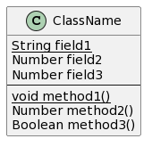
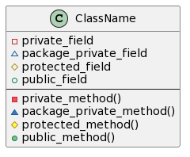
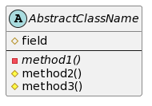
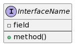
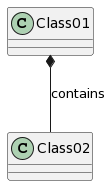
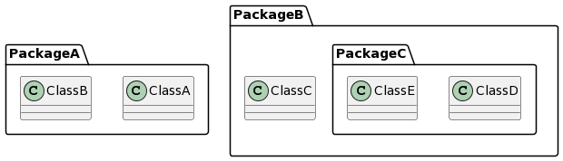

# クラス図
## 目次

# プロパティ&メソッド
|Syntax|Output|
|:------|:-----:|
|class ClassName { -br- {static} String field1 -br- Number field2 -br- Number field3 -br- -- -br- {static} void method1() -br- Number method2() -br- Boolean method3() -br- }||

# 可視性の定義
|Syntax|Output|
|:------|:-----:|
|class ClassName { -br- - private_field -br- ~ package_private_field -br- # protected_field -br- + public_field -br- -- -br- - private_method() -br-  ~package_private_method() -br- # protected_method() -br- + public_method() -br- }||

# 抽象クラス
|Syntax|Output|
|:------|:-----:|
|abstract class AbstractClassName { -br- # field -br- -- -br- - {abstract} method1() -br- # method2() -br- # method3() -br- }||

# インタフェース
|Syntax|Output|
|:------|:-----:|
|interface InterfaceName { -br- - field -br- -- -br- + method() -br- }||

<!-- TODO: |の変換 -->
<!-- # クラス間の関係
|Syntax|Output|
|:------|:-----:|
|Class01 <|-- Class02 -br- Class03 *-- Class04 -br- Class05 o-- Class06 -br- Class07 .. Class08 -br- Class09 -- Class10||
|Class11 <|.. Class12 -br- Class13 --> 
<!-- Class14 -br- Class15 ..> Class16 -br- Class17 ..|> Class18 -br- Class19 <--* Class20||
|Class21 #-- Class22 -br- Class23 x-- Class24 -br- Class25 }-- Class26 -br- Class27 +-- Class28 -br- Class29 ^-- Class30
|| -->

# ラベル
|Syntax|Output|
|:------|:-----:|
|ClassA *--  ClassB : contains||

# パッケージ
|Syntax|Output|
|:------|:-----:|
|package PackageA { -br- class ClassA { -br- } -br- class ClassB { -br- } -br- } -br- -br- package PackageB { -br- class ClassC { -br- } -br- package PackageC { -br- class ClassD { -br- } -br- -br- class ClassE { -br- } -br- } -br- }||

# 名前空間
|Syntax|Output|
|:------|:-----:|
|namespace PackageA { -br-  class Abc { -br- } -br- class Xyz { -br- } -br- }  -br- namespace PackageB { -br- class Abc { -br- } -br- -br- namespace PackageC { -br- class Xyz { -br- } -br- } -br- } -br- -br- PackageA.Abc ..> PackageA.Xyz -br- PackageB.Abc ..> PackageB.PackageC.Xyz||
