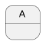
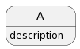
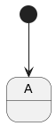
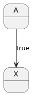
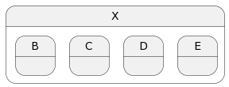
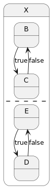
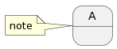

# ステート図

## ステート
|Syntax|Output|
|:------|:-----:|
|state A||
|state A : description||

## 遷移
|Syntax|Output|
|:------|:-----:|
|state A -br- [*] -->  A||
|state A -br- state X -br- A --> X : true||

## サブ状態
|Syntax|Output|
|:------|:-----:|
|state X { -br- state B -br- state C -br- state D -br- state E -br- }||

## 領域
|Syntax|Output|
|:------|:-----:|
|state X { -br- B --> C : true -br- C --> B : false -br- -- -br- E --> D : true -br- D --> E : false -br- }||

## 注釈
|Syntax|Output|
|:------|:-----:|
|state A -br- note left of A : note||
