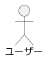
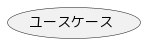
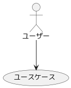
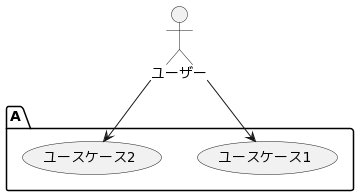

# ユースケース図
## 目次

# アクター
|Syntax|Output|
|:------|:-----:|
|actor ユーザー||
|:ユーザー:||

# ユースケース
|Syntax|Output|
|:------|:-----:|
|usecase ユースケース||
|(ユースケース)||

# 矢印
|Syntax|Output|
|:------|:-----:|
|ユーザー --> (ユースケース)||
|ユーザー -> (ユースケース)|.png)|

# パッケージ
|Syntax|Output|
|:------|:-----:|
|actor ユーザー -br- package A { -br- ユーザー --> (ユースケース1) -br- ユーザー --> (ユースケース2) -br- }||
|actor ユーザー -br- rectangle A { -br- ユーザー --> (ユースケース1) -br- ユーザー --> (ユースケース2) -br- }||

# ノート
|Syntax|Output|
|:------|:-----:|
|ユーザー --> (ユースケース) -br- note left of (ユースケース) : ノート||
