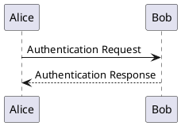

# シーケンス図

## シーケンス図とは？

シーケンス図は、あるプロセス内でオブジェクト（主にソフトウェアの構成要素）がメッセージを送り合う様子を示す図です。

シーケンス図は、上から下に向かって時系列に沿って進行していくため、時系列的な処理の流れを分かりやすく表現できます。一つのオブジェクトが、別のオブジェクトにメッセージを送信するときは、矢印で示されます。

また、オブジェクトは、それぞれ縦線で区切られた領域に表示され、オブジェクトが実行するメッセージは、縦線の間に表示されます。メッセージは、通常は下向きの矢印で示されますが、戻り値のあるメッセージは上向きの矢印で示されることがあります。シーケンス図は、システムのアーキテクチャの理解や、複雑な処理の流れを可視化するために有用です。

## 基本的な例

シーケンス "->" を、2 つの分類子間のメッセージを描画するために使います。分類子を、明示的に宣言する必要はありません。
点線の矢印を使う場合は "-->" とします。
また、 "<-" や "<--" を使うこともできます。
これらによって図の見た目が変わることはありませんが、可読性を高めることができます。 ただし、以上の方法はシーケンス図だけに当てはまります。ほかの種類の図には当てはまりません。

この PlantUML コードでは、以下のように分類子とメッセージが定義されています。

- 分類子
  - Alice: Alice という名前のオブジェクトが定義されています。
  - Bob: Bob という名前のオブジェクトが定義されています。
- メッセージ
  - Alice -> Bob: Alice オブジェクトから Bob オブジェクトへの Authentication Request というメッセージが送信されています。矢印は下向きで、メッセージの内容はコロンの後ろに記述されています。
  - Bob --> Alice: Bob オブジェクトから Alice オブジェクトへの Authentication Response というメッセージが送信されています。矢印は上向きで、メッセージの内容はコロンの後ろに記述されています。
